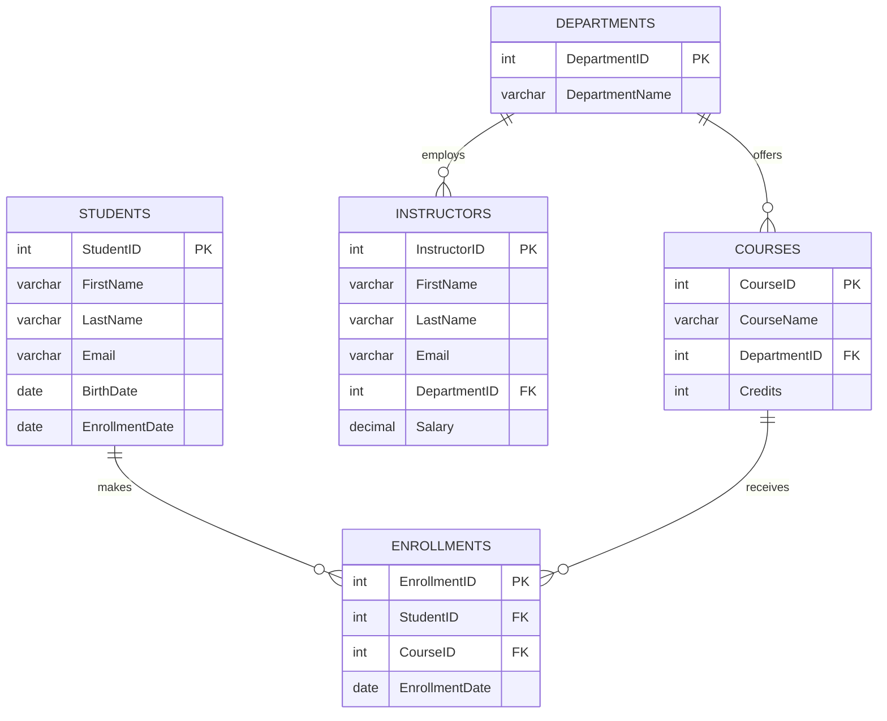

# 🎓 University Course Management System


---
## 📌 Overview

This **Final Project** models the core of a university: who studies, what is taught, who teaches it, and which department it belongs to. It applies a broad range of SQL concepts in one realistic, working database.

| | |
|---|---|
| 🗂️ **Design** | 5 related tables with primary keys, foreign keys and constraints |
| ✍️ **Operations** | Full CRUD on every table |
| 🔍 **Analysis** | Filtering, sorting, grouping, joins, subqueries |
| 🚀 **Advanced** | Window functions, `CASE` expressions, string and date functions |

### ✨ Highlights

- **Data integrity** — primary keys, foreign keys, unique emails, and a `CHECK` on credits.
- **No duplicate enrollments** — unique `(StudentID, CourseID)` pair.
- **Cascading deletes** — removing a student or course removes its enrollments.
- **Re-runnable script** — the SQL file recreates the database each time.

---

## 🧩 Schema


## video demo
[](https://drive.google.com/file/d/1unVlP39f6X1Yjr1mTiscqljLJjR-K7Jk/view?usp=sharing)

---
### 📖 Data Dictionary

| Table | Columns | Notes |
|:------|:--------|:------|
| 🏛️ `Departments` | `DepartmentID` INT PK, `DepartmentName` VARCHAR(100) | Name is unique |
| 🧑‍🎓 `Students` | `StudentID` INT PK, `FirstName`, `LastName` VARCHAR(50), `Email` VARCHAR(100), `BirthDate` DATE, `EnrollmentDate` DATE | Email is unique |
| 👩‍🏫 `Instructors` | `InstructorID` INT PK, `FirstName`, `LastName` VARCHAR(50), `Email` VARCHAR(100), `DepartmentID` INT FK, `Salary` DECIMAL(10,2) | Email is unique |
| 📚 `Courses` | `CourseID` INT PK, `CourseName` VARCHAR(100), `DepartmentID` INT FK, `Credits` INT | `Credits > 0` |
| 📝 `Enrollments` | `EnrollmentID` INT PK, `StudentID` INT FK, `CourseID` INT FK, `EnrollmentDate` DATE | Unique `(StudentID, CourseID)`, cascade delete |

### 🗃️ Sample Data

| Table | Rows |
|:------|:-----|
| Departments | (1, Computer Science) · (2, Mathematics) |
| Students | (1, John Doe, 2022-08-01) · (2, Jane Smith, 2021-08-01) |
| Instructors | (1, Alice Johnson, Dept 1, 85000) · (2, Bob Lee, Dept 2, 78000) |
| Courses | (101, Introduction to SQL, Dept 1, 3 credits) · (102, Data Structures, Dept 2, 4 credits) |
| Enrollments | (1, Student 1, Course 101, 2022-08-01) · (2, Student 2, Course 102, 2021-08-01) |

---

## ⚡ Quick Start

**Requirements:** MySQL 8.0+ (window functions are needed for Query 15) and any SQL client.

```bash
git clone <your-repo-url>
cd university-course-management

# Runs schema + sample data + CRUD + queries
mysql -u <username> -p < university_course_management.sql
```

Prefer a GUI? Open `university_course_management.sql` in MySQL Workbench or DBeaver, run the schema and sample data first, then run each query one at a time.

| Step | Section | Purpose |
|:-:|:--------|:--------|
| 1 | Schema | Creates the database and five tables |
| 2 | Sample data | Loads the initial records |
| 3 | CRUD (Query 1) | Inserts, reads, updates and deletes test records |
| 4 | Queries 2–16 | Runs the analysis queries |

---

## ✍️ CRUD Operations

**Query 1** adds a temporary test record to every table, modifies it, and then deletes it, so the sample data stays intact.

<details>
<summary><b>Show CRUD SQL</b></summary>

```sql
-- CREATE
INSERT INTO Departments (DepartmentID, DepartmentName) VALUES (3, 'Physics');

INSERT INTO Students (StudentID, FirstName, LastName, Email, BirthDate, EnrollmentDate)
VALUES (99, 'Test', 'Student', 'test.student@email.com', '2001-04-12', '2023-08-20');

INSERT INTO Instructors (InstructorID, FirstName, LastName, Email, DepartmentID, Salary)
VALUES (99, 'Carol', 'White', 'carol.white@univ.com', 3, 72000.00);

INSERT INTO Courses (CourseID, CourseName, DepartmentID, Credits)
VALUES (999, 'Database Systems', 1, 3);

INSERT INTO Enrollments (EnrollmentID, StudentID, CourseID, EnrollmentDate)
VALUES (99, 99, 999, '2023-08-20');

-- READ
SELECT * FROM Departments;
SELECT * FROM Students;
SELECT * FROM Instructors;
SELECT * FROM Courses;
SELECT * FROM Enrollments;

-- UPDATE
UPDATE Departments SET DepartmentName = 'Applied Physics'    WHERE DepartmentID = 3;
UPDATE Students    SET Email = 'test.student@university.edu' WHERE StudentID = 99;
UPDATE Instructors SET Salary = 75000.00                     WHERE InstructorID = 99;
UPDATE Courses     SET Credits = 4                           WHERE CourseID = 999;
UPDATE Enrollments SET EnrollmentDate = '2023-08-25'         WHERE EnrollmentID = 99;

-- DELETE (child tables first to respect foreign keys)
DELETE FROM Enrollments WHERE EnrollmentID = 99;
DELETE FROM Courses     WHERE CourseID     = 999;
DELETE FROM Instructors WHERE InstructorID = 99;
DELETE FROM Students    WHERE StudentID    = 99;
DELETE FROM Departments WHERE DepartmentID = 3;
```
</details>

---

## 🔎 Queries

| # | Task | Technique |
|:-:|:-----|:----------|
| 1 | CRUD on all tables | `INSERT` `SELECT` `UPDATE` `DELETE` |
| 2 | Students enrolled after 2022 | `WHERE` |
| 3 | Mathematics courses, limit 5 | `JOIN` `LIMIT` |
| 4 | Courses with more than 5 students | `GROUP BY` `HAVING` |
| 5 | Students in **both** SQL and Data Structures | `HAVING COUNT(DISTINCT)` |
| 6 | Students in **either** course | `IN` `DISTINCT` |
| 7 | Average credits | `AVG` |
| 8 | Max Computer Science instructor salary | `MAX` |
| 9 | Students per department | `LEFT JOIN` |
| 10 | Students and their courses | `INNER JOIN` |
| 11 | All students, courses if any | `LEFT JOIN` |
| 12 | Students in courses with more than 10 students | Subquery |
| 13 | Year of enrollment | `YEAR()` |
| 14 | Instructor full name | `CONCAT()` |
| 15 | Running total of enrollments | Window function |
| 16 | Senior / Junior label | `CASE` |

<details>
<summary><b>Queries 2–4 · Filtering & grouping</b></summary>

```sql
-- 2. Students who enrolled after 2022
SELECT StudentID, FirstName, LastName, Email, EnrollmentDate
FROM   Students
WHERE  EnrollmentDate > '2022-12-31'
ORDER  BY EnrollmentDate;

-- 3. Mathematics courses (limit 5)
SELECT c.CourseID, c.CourseName, c.Credits
FROM   Courses c
JOIN   Departments d ON d.DepartmentID = c.DepartmentID
WHERE  d.DepartmentName = 'Mathematics'
ORDER  BY c.CourseName
LIMIT  5;

-- 4. Courses with more than 5 students
SELECT c.CourseID, c.CourseName, COUNT(e.StudentID) AS StudentCount
FROM   Courses c
JOIN   Enrollments e ON e.CourseID = c.CourseID
GROUP  BY c.CourseID, c.CourseName
HAVING COUNT(e.StudentID) > 5
ORDER  BY StudentCount DESC;
```
</details>

<details>
<summary><b>Queries 5–6 · Both vs. either course</b></summary>

```sql
-- 5. Enrolled in BOTH courses
SELECT s.StudentID, s.FirstName, s.LastName
FROM   Students s
JOIN   Enrollments e ON e.StudentID = s.StudentID
JOIN   Courses c     ON c.CourseID  = e.CourseID
WHERE  c.CourseName IN ('Introduction to SQL', 'Data Structures')
GROUP  BY s.StudentID, s.FirstName, s.LastName
HAVING COUNT(DISTINCT c.CourseID) = 2;

-- 6. Enrolled in EITHER course
SELECT DISTINCT s.StudentID, s.FirstName, s.LastName, c.CourseName
FROM   Students s
JOIN   Enrollments e ON e.StudentID = s.StudentID
JOIN   Courses c     ON c.CourseID  = e.CourseID
WHERE  c.CourseName IN ('Introduction to SQL', 'Data Structures')
ORDER  BY s.StudentID;
```
</details>

<details>
<summary><b>Queries 7–9 · Aggregates</b></summary>

```sql
-- 7. Average credits
SELECT ROUND(AVG(Credits), 2) AS AvgCredits FROM Courses;

-- 8. Max salary in Computer Science
SELECT MAX(i.Salary) AS MaxSalary
FROM   Instructors i
JOIN   Departments d ON d.DepartmentID = i.DepartmentID
WHERE  d.DepartmentName = 'Computer Science';

-- 9. Students enrolled per department
SELECT d.DepartmentID, d.DepartmentName,
       COUNT(DISTINCT e.StudentID) AS StudentCount
FROM   Departments d
LEFT JOIN Courses c     ON c.DepartmentID = d.DepartmentID
LEFT JOIN Enrollments e ON e.CourseID     = c.CourseID
GROUP  BY d.DepartmentID, d.DepartmentName
ORDER  BY StudentCount DESC;
```
</details>

<details>
<summary><b>Queries 10–12 · Joins & subquery</b></summary>

```sql
-- 10. INNER JOIN
SELECT s.StudentID, s.FirstName, s.LastName, c.CourseID, c.CourseName
FROM   Students s
INNER JOIN Enrollments e ON e.StudentID = s.StudentID
INNER JOIN Courses c     ON c.CourseID  = e.CourseID
ORDER  BY s.StudentID, c.CourseID;

-- 11. LEFT JOIN
SELECT s.StudentID, s.FirstName, s.LastName, c.CourseID, c.CourseName
FROM   Students s
LEFT JOIN Enrollments e ON e.StudentID = s.StudentID
LEFT JOIN Courses c     ON c.CourseID  = e.CourseID
ORDER  BY s.StudentID, c.CourseID;

-- 12. Students in courses with more than 10 students
SELECT s.StudentID, s.FirstName, s.LastName
FROM   Students s
WHERE  s.StudentID IN (
           SELECT e.StudentID
           FROM   Enrollments e
           WHERE  e.CourseID IN (
                      SELECT CourseID
                      FROM   Enrollments
                      GROUP  BY CourseID
                      HAVING COUNT(*) > 10));
```
</details>

<details>
<summary><b>Queries 13–16 · Functions, window & CASE</b></summary>

```sql
-- 13. Enrollment year
SELECT StudentID, FirstName, LastName, EnrollmentDate,
       YEAR(EnrollmentDate) AS EnrollmentYear
FROM   Students;

-- 14. Instructor full name
SELECT InstructorID,
       CONCAT(FirstName, ' ', LastName) AS InstructorFullName,
       Email
FROM   Instructors;

-- 15. Running total of enrollments
SELECT EnrollmentDate,
       COUNT(*)                                     AS StudentsEnrolled,
       SUM(COUNT(*)) OVER (ORDER BY EnrollmentDate) AS RunningTotal
FROM   Enrollments
GROUP  BY EnrollmentDate
ORDER  BY EnrollmentDate;

-- 16. Senior / Junior label
SELECT StudentID, FirstName, LastName, EnrollmentDate,
       CASE
           WHEN EnrollmentDate < DATE_SUB(CURDATE(), INTERVAL 4 YEAR) THEN 'Senior'
           ELSE 'Junior'
       END AS StudentLevel
FROM   Students
ORDER  BY EnrollmentDate;
```
</details>

The complete script is in [`university_course_management.sql`](university_course_management.sql).

---

## 📊 Sample Output

Expected results on the sample data (Query 16 evaluated as of September 2026).

| Query | Result |
|:-:|:--|
| 2 | *Empty* — no student enrolled after 2022 |
| 3 | `102 · Data Structures · 4` |
| 4 | *Empty* — no course has more than 5 students |
| 5 | *Empty* — no student is in both courses |
| 6 | `John Doe → Introduction to SQL` · `Jane Smith → Data Structures` |
| 7 | `3.50` |
| 8 | `85000.00` |
| 9 | `Computer Science: 1` · `Mathematics: 1` |
| 10 / 11 | `John Doe → 101 Introduction to SQL` · `Jane Smith → 102 Data Structures` |
| 12 | *Empty* — no course has more than 10 students |
| 13 | `John: 2022` · `Jane: 2021` |
| 14 | `Alice Johnson` · `Bob Lee` |
| 15 | `2021-08-01: 1 → total 1` · `2022-08-01: 1 → total 2` |
| 16 | `Jane Smith: Senior` · `John Doe: Senior` |

---

## 📝 Notes & Assumptions

- 💰 **Salary column** — Query 8 needs salaries, which the original `Instructors` table lacks, so a `Salary` column was added.
- 📅 **"After 2022"** — means enrollment dates from 2023-01-01 onward.
- 📉 **Empty results** — the sample data is small, so Queries 2, 4, 5 and 12 return no rows. Optional extra test data is included (commented out) in the SQL file; Query 12 would need 11 or more students in one course.
- 🏛️ **Query 9** — students are counted through the courses each department offers; a student in several courses of one department is counted once.
- 🎖️ **Query 16** — "Senior" means enrolled more than 4 years before `CURDATE()`, so output changes over time.
- 🔤 **Naming** — `EnrollmentID` is used consistently (the brief once wrote `EnrolmentID`).
- 🔁 **Other databases** — for PostgreSQL or SQL Server, replace `YEAR`, `CONCAT`, `DATE_SUB`, `CURDATE` and `LIMIT` with `EXTRACT`, `||`, `INTERVAL`, `CURRENT_DATE` and `FETCH FIRST` / `TOP`.

---

## 🩺 Troubleshooting

| Problem | Fix |
|:--------|:----|
| Syntax error near `OVER` (Query 15) | Window functions need MySQL 8.0+. Check with `SELECT VERSION();` |
| Foreign key error while deleting | Delete child rows first: `Enrollments`, then `Courses` / `Instructors`, then `Students` / `Departments` |
| `Duplicate entry` on insert | Emails and `(StudentID, CourseID)` pairs must be unique |
| Queries return no rows | The sample data is small; add more rows to see results |

---

## 📁 Project Structure

```
.
├── README.md                          # Project documentation
└── university_course_management.sql   # Schema, sample data, CRUD, and all queries
```

---

<div align="center">

**Built by [Your Name](https://github.com/your-username)** · Released under the MIT License · Made with ❤️ and SQL

</div>
